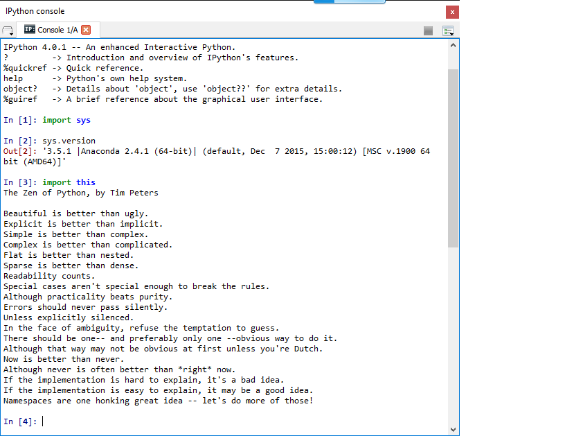

UECM3033 Assignment #1 Report
========================================================

- Prepared by: Lim Sip Yee
- Tutorial Group: T3

--------------------------------------------------------

## Task 1 -- setup a github repository

The reports, codes and supporting documents are uploaded to Github at: 

[https://github.com/sipyeelim/UECM3033_assign1]

---------------------------------------------------------

## Task 2 -- setup python

Put here the screen shot of file (python.png)

------------------------------------------------------------

## Task 3 -- modify and run Python script

In this section, please report:

1. The hexadecimal value of your student ID.

Hexadecimal value of 1202348 is 0x1258ac

2. Write down the definite integrals that you have chosen.

$\int_0^{(\pi^2)/4} \sin(\sqrt x)$ $cos(\sqrt x)$ = $\pi^2$/4

3. Write down your system of 10 linear equations.

\begin{align*}

1x_0 + 3 x_1 + 5 x_2 + 9x_3 + 10x_4 + 15x_5 + 16x_6 + 14x_7 + 12x_8 + 4x_9 &= 5 \\
10x_0 + 9x_1 + 8x_2 + 7x_3 + 6x_4 + 5x_5 + 4x_6 + 3x_7 + 2x_8 + 1x_9 &=6 \\
1x_0+8x_1+6x_2+2x_3+3x_4+20x_5+5x_6+4x_7+8x_8+5x_9 &= 7\\
6x_0+4x_1+60x_2+70x_3+40x_4+80x_5+70x_6+9x_7+11x_8+10x_9 &= 8 \\
6x_0+4x_1+60x_2+70x_3+40x_4+80x_5+70x_6+9x_7+11x_8+10x_9 &= 8 \\
6x_0+4x_1+60x_2+70x_3+40x_4+80x_5+70x_6+9x_7+11x_8+10x_9 &= 8 \\

x_0 + 2 x_1 &= 8.
\end{align*}

-----------------------------------

last modified: change your date here
